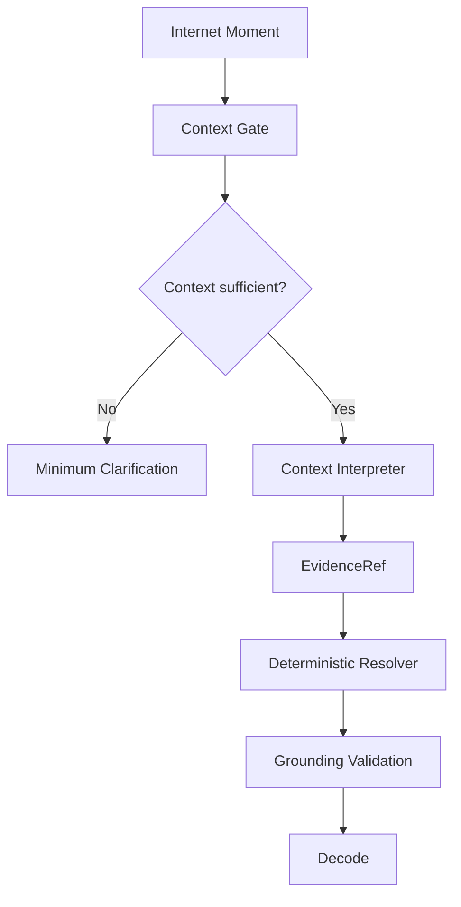
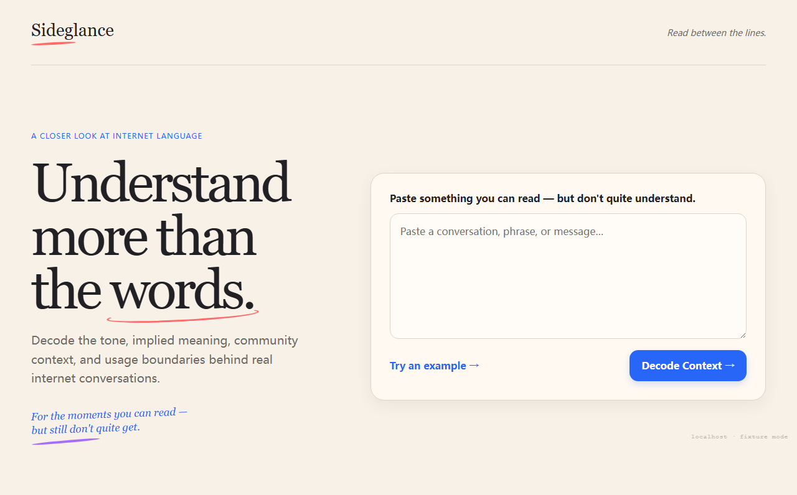
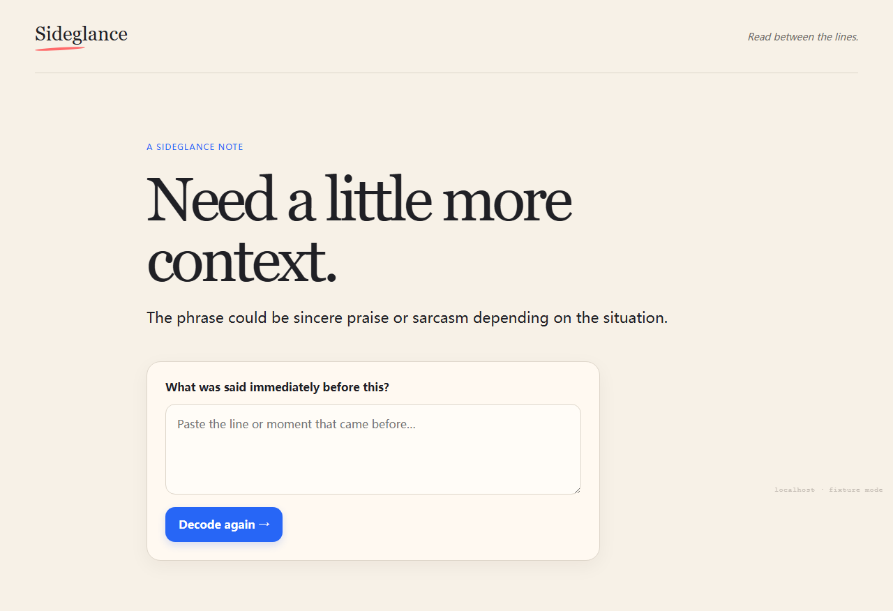
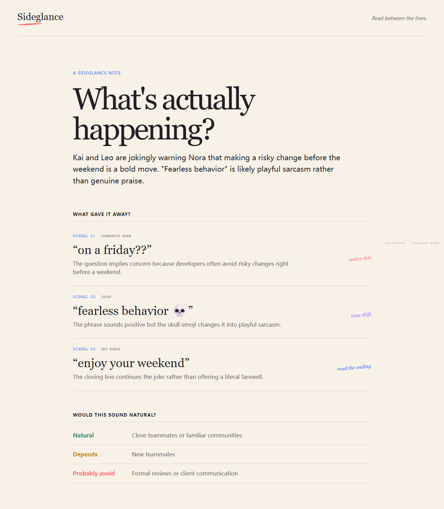

# Sideglance

Read between the lines.

Sideglance is a context intelligence tool for people who understand the words but are not sure they understand what an online interaction actually means.

## Live demo

[Try the public demo](https://cyrilla-mist.github.io/sideglance/). For reproducible judging, the hosted demo uses Sideglance's deterministic fixture path; the repository also contains the Gemini-backed runtime architecture.

## Presentation deck

[View the Sideglance presentation deck](docs/Sideglance_Deck.pdf).

## The problem

People can understand every English word in a post, chat, meme, or thread and still miss sarcasm, irony, social tone, community norms, cultural references, or usage boundaries.

Translation tells you what the words say. Context tells you what people mean.

## What Sideglance does

Paste an Internet Moment into Decode. Sideglance checks whether enough context exists, asks one minimum clarification question when it does not, then explains the interaction with evidence-backed signals, tone, confidence, and usage boundaries. It also shows whether the wording would sound natural in another situation.

General AI answers what you ask. Sideglance detects the context you did not know you were missing.

## How it works



The Context Gate decides whether interpretation is safe. The Interpreter produces structured contextual analysis. EvidenceRef makes the model point to evidence IDs instead of inventing free-form quotes. The deterministic resolver maps those references back to exact source text, and grounding validation rejects unsupported evidence or invalid contracts.

We constrain probabilistic AI with deterministic product logic.

## AI/ML integration

Google Gemini (`MODEL_NAME=gemini-3.7-flash`) performs context sufficiency reasoning and structured social/pragmatic interpretation. Deterministic code performs schema validation, evidence resolution, grounding, confidence and presentation guards, and safe failure handling. The Worker is the server-side boundary and keeps provider credentials away from the browser. The deployed Worker and health endpoint are available; live provider inference validation remains affected by a remote transport issue, so the stable demo uses deterministic fixtures.

## Screenshots








## Tech stack

- Frontend: TypeScript, Vite, semantic HTML/CSS
- API: Cloudflare Worker and Wrangler
- AI: Google Gemini through a server-side provider transport
- Validation: TypeScript contracts, schema guards, deterministic EvidenceRef resolution and grounding
- Testing: Vitest, Playwright

## Local development

```bash
npm install
npm run worker:dev
npm run dev
```

Run the checks with:

```bash
npm test
npm run test:e2e
npm run typecheck
npm run worker:typecheck
npm run build
```

The default demo path is fixture-backed and network-free. Live AI mode requires the server-side `MODEL_API_KEY` environment variable; never put credentials in frontend variables or tracked files.

## Limitations and future

Sideglance focuses on pasted text rather than OCR or browser integration. It avoids strong interpretation when context is insufficient, and cultural or social interpretation remains probabilistic rather than objective fact. The current hackathon scope is Decode only. Sideglance Radar is a future context-learning capability, not part of this release.
