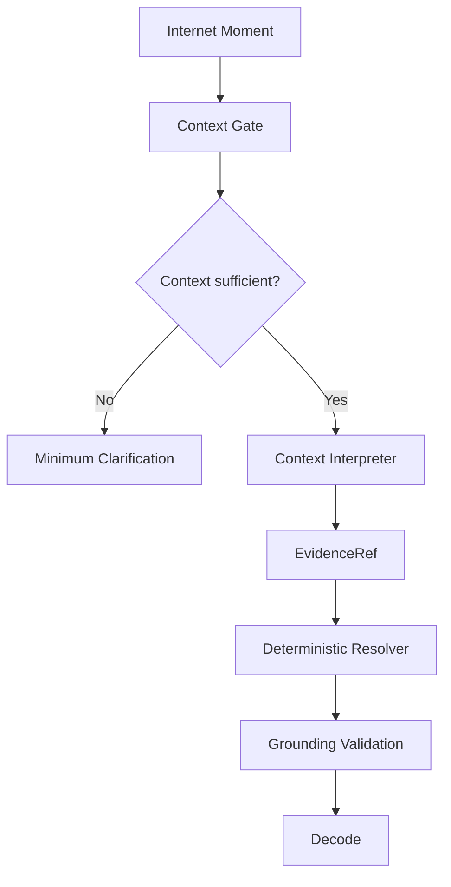

# Sideglance

**Read between the lines.**

Sideglance is an **internet context intelligence** product for people who understand the words but are not sure they understand what an online interaction actually means.

## Current Release

The current public release is centered on **Decode**: immediate interpretation of an Internet Moment with explicit context sufficiency, evidence-backed signals, tone, confidence, and usage boundaries.

- [Live demo](https://cyrilla-mist.github.io/sideglance/)
- [Product direction](docs/product-direction.md)
- [Documentation map](docs/README.md)
- [September 2026 presentation deck](docs/Sideglance_Deck.pdf)

The hosted demo uses a deterministic fixture path so the product flow remains reproducible without depending on a live model request.

## The Problem

People can understand every English word in a post, chat, meme, or thread and still miss sarcasm, irony, social tone, community norms, cultural references, implied intent, or usage boundaries.

**Translation tells you what the words say. Context tells you what people mean.**

## Decode

Paste an Internet Moment into Decode. Sideglance checks whether enough context exists, asks one minimum clarification question when it does not, then explains the interaction with evidence-backed signals, tone, confidence, and usage boundaries.

It can also help show whether wording that works in one context would sound natural in another.

General AI answers what you ask. Sideglance is designed around the context you may not know you are missing.

## How Decode Works



The Context Gate decides whether interpretation is safe. The Interpreter produces structured contextual analysis. EvidenceRef makes the model point to evidence IDs instead of inventing free-form quotes. The deterministic resolver maps those references back to exact source text, and grounding validation rejects unsupported evidence or invalid contracts.

**Probabilistic interpretation is constrained by deterministic product logic.**

## Product Direction

The long-term Sideglance product is organized into three connected surfaces:

```text
Sideglance
├── Decode
│   Understand this moment.
│
├── Radar
│   Build context instinct over time.
│
└── Archive
    Preserve and revisit context knowledge.
```

### Decode

Implemented in the current public release.

### Radar

Planned long-term learning surface. The existing [English Radar](https://github.com/cyrilla-mist/english-radar) project is the main learning-system foundation for this direction, including Signals, review loops, context / tone / usage-boundary fields, quizzes, and personal learning data.

English Radar remains a separate repository today; this README does not claim that Radar has already been integrated into Sideglance.

### Archive

Planned shared context-knowledge and reference layer connecting saved, decoded, and learned context over time.

See [`docs/product-direction.md`](docs/product-direction.md) for the current product model and migration principles.

## AI / ML Integration

The submission-era runtime architecture uses Google Gemini for context-sufficiency reasoning and structured social / pragmatic interpretation. Deterministic code performs schema validation, evidence resolution, grounding, confidence and presentation guards, and safe failure handling.

The Cloudflare Worker is the server-side provider boundary and keeps provider credentials away from the browser.

> **September 2026 release note:** live provider inference validation was affected by a remote transport issue during the hackathon validation period, so the stable public demo uses deterministic fixtures. This note records the release state; it should not be read as a fresh claim about the provider's current availability.

## Screenshots


## Tech Stack

- Frontend: TypeScript, Vite, semantic HTML / CSS
- API: Cloudflare Worker and Wrangler
- AI: Google Gemini through a server-side provider transport
- Validation: TypeScript contracts, schema guards, deterministic EvidenceRef resolution and grounding
- Testing: Vitest, Playwright

## Local Development

```bash
npm install
npm run worker:dev
npm run dev
```

Run the checks with:

```bash
npm test
npm run test:e2e
npm run typecheck
npm run worker:typecheck
npm run build
```

The default demo path is fixture-backed and network-free. Live AI mode requires the server-side `MODEL_API_KEY` environment variable; never put credentials in frontend variables or tracked files.

## Current Boundaries

The current release focuses on pasted text rather than OCR or browser integration. It avoids strong interpretation when context is insufficient, and cultural or social interpretation remains probabilistic rather than objective fact.

The current repository release does **not** claim production implementations of:

- the integrated Radar surface;
- the shared Archive layer;
- unified cross-surface accounts or persistence;
- a complete Decode-to-Radar learning pipeline.

Those belong to post-hackathon product development rather than the September 2026 release.
